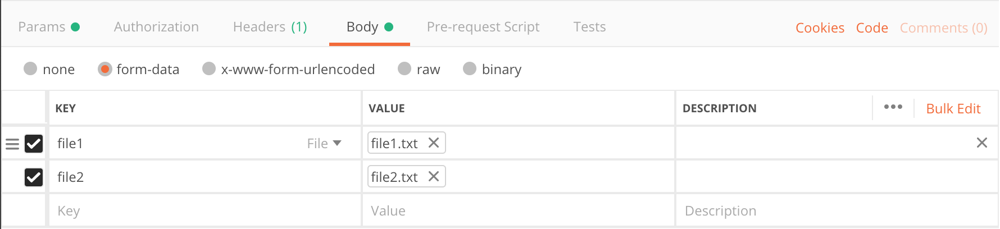

## File microservice

Python 3. Used Flask for the API and TinyDB for the database - for a lightweight architecture.

"Write an app in your programming language of choice that takes as input a list of files and a provider parameter. Depending on the provider parameter either write the files to a database, the file system, or print the files to console or popup window. The parameter values are “provider1” for database, “provider2” for file system, “provider3” for console/popup."

#### Install

To install dependecies, make sure pip is installed and run the following command.
  ```pip install requirements.txt```

#### Run the app
To run, use the following command.
  ```
  $ python app.py

   * Serving Flask app "app" (lazy loading)
   * Environment: production
   WARNING: This is a development server. Do not use it in a production deployment.
   Use a production WSGI server instead.
   * Debug mode: off
   * Running on http://127.0.0.1:5000/ (Press CTRL+C to quit)
   * Restarting with stat
 ```

Use the url to test locally. http://127.0.0.1:5000/

To test, use the provider parameters below in the request URL. 

Use a header of Content-Type=multipart/form-data

Attach files to the body of your request as formdata. Example of the files in the body of request, in Postman.



- Database
  ``` http://127.0.0.1:5000/add-file?provider=provider1 ```


- Local
  ``` http://127.0.0.1:5000/add-file?provider=provider2 ```

- Print
  ``` http://127.0.0.1:5000/add-file?provider=provider3 ```

